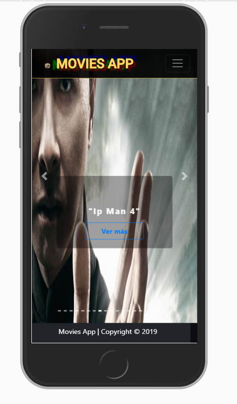
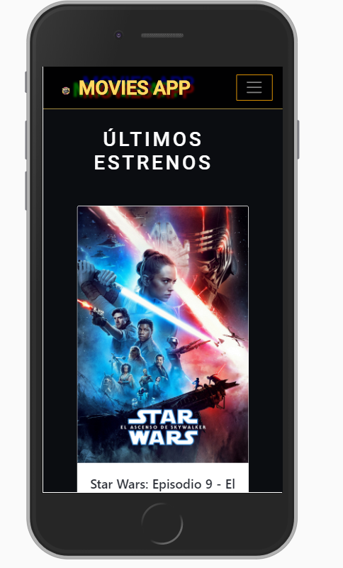
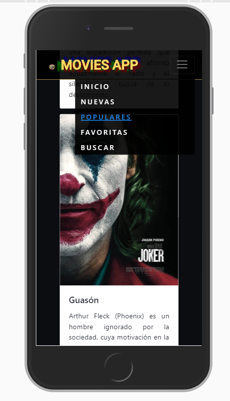
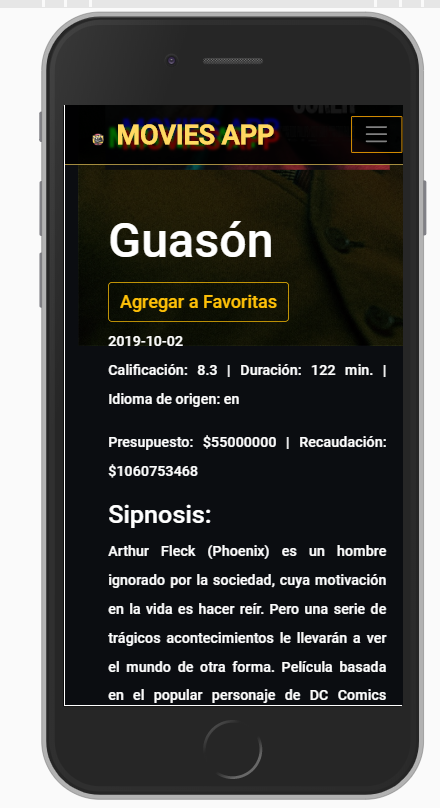
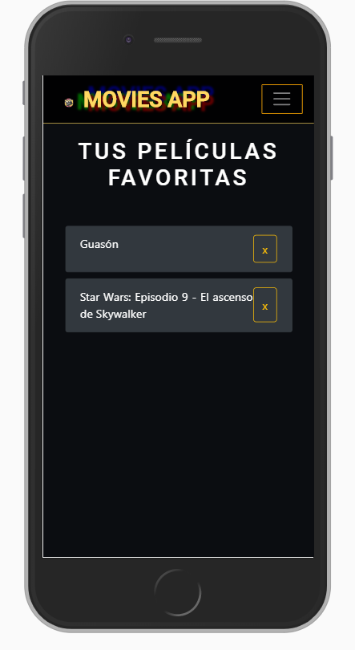
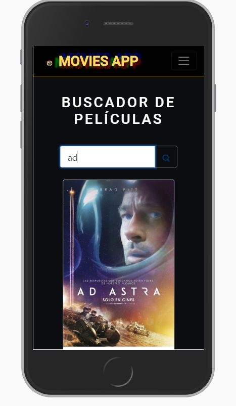
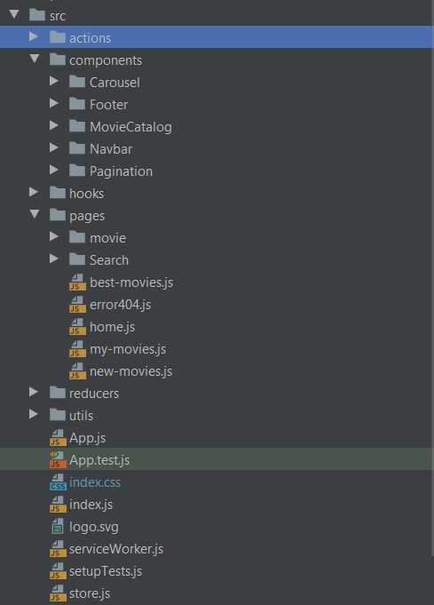

## MOVIES APP

Movies App es una web app responsive cuya finalidad es ayudarte crear a una lista de todas aquellas películas que deseas
ver, mismas que podrás eliminar cuando hayas cumplido con dicho cometido. Para esto hemos creado una interfaz que te
permitirá buscar información de diferentes títulos, navegar entre los nuevos estrenos y conocer las más votadas por nuestros cinéfilos.  

### NAVEGANDO POR NUESTRA APP
Al inicio de nuesta página podras observar un carousel con los 20 últimos entrenos.
 

Después podras navegar entre los títulos nuevos o populares.

Dar click a cualquier tarjeta te lleverá a ver la información particular
de cada una y desde ahí podras agregarla a tus pelis favoritas.

Si ya sabes lo que quieres encontrar, también puedes buscarlo.

### TECNOLOGÍAS UTILIZADAS

- React JS
- HTML5
- SCSS y CSS
- Bootstrap React
- Yarn

### ESTRUCTURA DE LAS CARPETAS

### PLANES FUTUROS

Un segundo alcance será realizar test unitarios, así como permitirte filtrar películas por distintas categorias, calificarlas y hacer comentarios.
